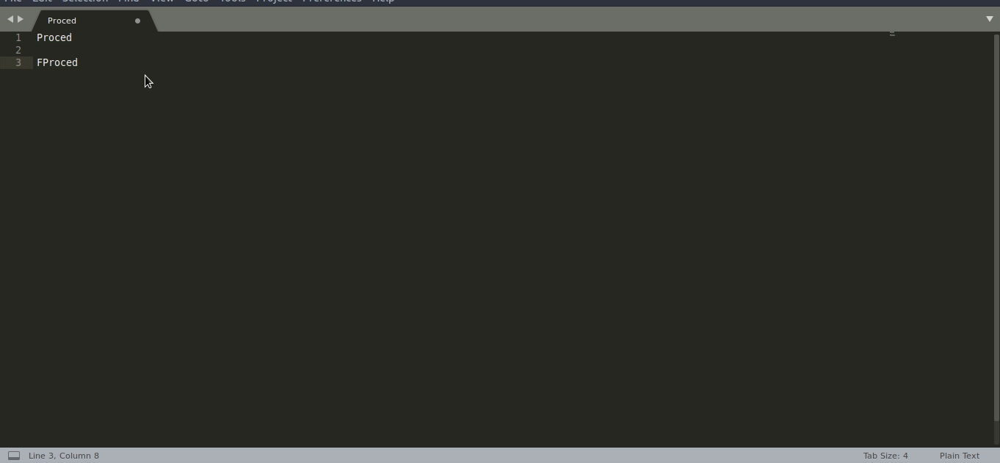

# PseudoCodigoSyntax
Syntax y Snippets que uso en Sublime Text 3 para escribir Pseudocodigo

Inclute Snippets para:

- Si                  
- Registro
- Mientras            
- Proced
- Repetir
- Flecha
- Función
- Para
- Ref                 
- Val
- Segun

Incluye Syntax Highlight para: 

- Si       
- Sino
- Registro
- Mientras            
- Proced
- Función
- Repetir
- Para
- O                  
- Y
- Ref                 
- Val
- Segun

Para poder usarlo se tiene que llevar todos los archivos de la carpeta User a su carpeta /Packages/User de sublime text, luego crear un archivo con extensión .caece desde Sublime Text y especificarle en View -> Syntax -> Open All With current extension as... -> Caece

